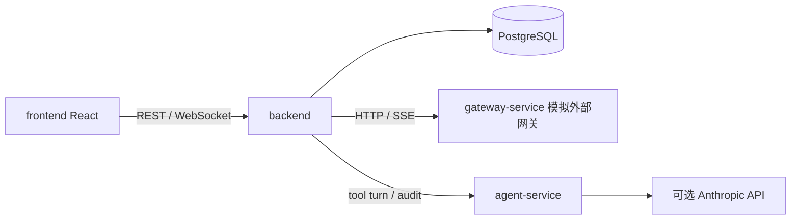

# 系统架构与可靠性

## 边界

`backend/src/domains` 按 account、auth、group、message、sequence、agent 拆分业务；`infrastructure` 管理 PostgreSQL、网关事件、实时事件和指标。模块通过数据库持久状态及小范围函数接口协作。网关模拟器是唯一允许模拟外部行为的服务；Agent 默认规则引擎是真实可执行的协议服务，另有 Anthropic 适配器。Frontend 只访问 Backend，API 类型从 OpenAPI 生成。

## 关键链路

- **账号**：迁移预置 idle 账号。状态转移表与 CAS 检查集中在 `domains/account/state.ts`。终态写入与成员移除、排队消息取消、序列步骤跳过在同一数据库事务完成。
- **建群与退群**：API 先记录 job，worker 以 PostgreSQL advisory lock 竞争执行；网关建群传 `clientJobId`，重启后同一 job 不会重复建群。邀请、异步入群、提升管理员和群主最后退群均按进度恢复。
- **消息**：发送前持久化 outbox 行。202 只是 accepted，`message_sent` 才是 sent。504 进入 unknown，超过网关承诺的 2 秒窗口后先按 clientMsgId 查询，再决定最多重发一次。`message` 回流合并为自己消息，入站按 `(group_id,msg_id)` 去重。
- **事件**：网关 SSE 的 `eventId` 存入 `gateway_events`；游标仅推进已持久化的连续前缀。断开后带 `since` 补拉；数据库处理失败会发 `inconsistency` 并重试。WebSocket 事件有 PostgreSQL 全局 seq，断线后可用 `sinceSeq` 补齐。
- **Agent**：非自身消息进入 pending 表。单群一个 running run，由唯一索引保护；worker 用 advisory lock 保证执行权。每轮协议、历史、步骤、审计结论及工具副作用持久化。审计明确 pass 后才能发送或移除成员；相同 run/key 返回已有结果。运行限制为 12 步和 60 秒有效运行时间。
- **序列**：启动前解析所有变量并预检，运行快照记录取值和来源。单群运行唯一索引解决并发；步骤按上一条实际发出时刻排期，限流等待，服务重启后恢复最早待执行步骤。
- **媒体**：网关 URL 的字节由后台 worker 下载到 `MEDIA_DIR`，数据库保留文件路径与类型，授权接口读取。过期清理同步清除数据库路径。

## 生产部署边界

Backend 可使用多个实例共享 PostgreSQL，jobs/agent 的 advisory lock 和唯一索引用于并发协调。当前媒体是本地文件存储，多实例部署前应替换为共享对象存储。Gateway 模拟器的 JSON 状态文件及故障注入接口只服务本题演示，真实外部网关由相同 HTTP/SSE 契约替换。`/api/health` 检查数据库连通，服务启动时拒绝落后 schema；运维需另行配置 PostgreSQL 备份、TLS、秘密管理、日志采集和 OTLP/Prometheus 接收端。详见 [可观测性](observability.md)。
